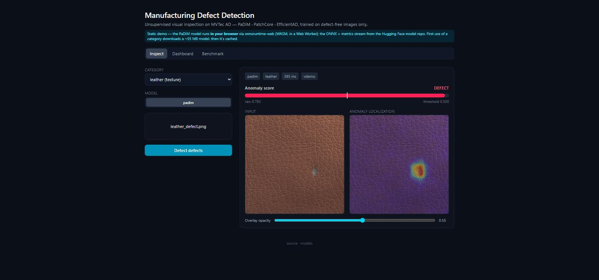

# Manufacturing Defect Detection System (MDDF)

[](https://github.com/VeerbhadraMahant/mddf/actions/workflows/ci.yml)


Unsupervised visual quality inspection on the [MVTec AD](https://www.mvtec.com/company/research/datasets/mvtec-ad)
dataset. Models are trained **only on defect-free images** — the realistic setting for a
factory line, where defects are rare and their appearance is open-ended — and served
**CPU-only** (no PyTorch at runtime) behind a FastAPI service with a React inspection UI.

**A method comparison**, one model trained per category per method:

| Method | Paradigm | Backbone | Idea | Status |
|---|---|---|---|---|
| **PaDiM** | distribution | ResNet-18 | per-patch multivariate Gaussian of normal features; anomaly = Mahalanobis distance | ✅ 15/15 trained |
| **PatchCore** | memory bank | WideResNet-50 | coreset of normal patch embeddings; anomaly = distance to nearest normal patch | ✅ 15/15 trained |
| **EfficientAD** | distillation | custom PDN | student–teacher + autoencoder disagreement; real-time edge inference | pipeline done, single-category verified (AUROC 1.0); full run pending non-laptop GPU |

Each emits a **native pixel-level anomaly map**, upsampled and overlaid on the input
for operator-facing localization — no Grad-CAM (see [Design notes](#design-notes)).
Metrics: image + pixel AUROC, **AUPRO** (region-overlap), F1, plus an
[operating-point analysis](#operating-points) (recall vs. false-alarm trade-off) and
CPU p50/p95 latency, fp32 and **INT8**.

**▶ Live demo:** https://bhadra244131-mddf-demo.static.hf.space/ — the PaDiM model runs
entirely **in your browser** (onnxruntime-web / WASM, in a Web Worker); the ONNX +
benchmark metrics stream from the
[Hugging Face model repo](https://huggingface.co/bhadra244131/mddf-artifacts). No server,
no cold start.



**Full service** (all methods, FastAPI + React inspection UI):
`docker run -p 7860:7860 ghcr.io/veerbhadramahant/mddf` (image published by `release.yml`
on each `v*` tag).

See [`docs/RESULTS.md`](docs/RESULTS.md) for the full measured table,
[`docs/OPERATING_POINTS.md`](docs/OPERATING_POINTS.md) for the recall/false-alarm
analysis, and [`MODEL_CARD.md`](MODEL_CARD.md) for scope and limitations.

---

## Quickstart

```bash
python -m pip install -e ".[dev]"     # runtime + dev tooling (no PyTorch)
make check                            # ruff + mypy + pytest
make serve                            # http://127.0.0.1:7860/api/docs
```

Local training needs an NVIDIA GPU and the heavier stack:

```bash
python -m pip install -e ".[train,dev]"                  # + PyTorch, Anomalib, Lightning
make install-cuda                                         # overlay the CUDA 12.6 torch build
make data                                                 # download + verify MVTec AD  (M1)
make train ARGS="--model patchcore --category leather"    # (M2)
```

> PyPI's `torch` is CPU-only; `make install-cuda` replaces it with `torch==2.14.0+cu126`
> from the PyTorch index. Verified against an RTX 4060 (8 GB, Ada / sm_89).

---

## Architecture

```
   training  (local RTX 4060 · PyTorch + Anomalib · [train] extra)
   ────────────────────────────────────────────────────────────────
   MVTec AD (good only) ─► PaDiM / PatchCore / EfficientAD ─► Engine.fit + test
                                                    ─► ONNX export (+ optional INT8)
                                                    ─► artifacts/<model>/<category>/
                                                         model.onnx · model.int8.onnx
                                                         preprocess.json · metrics.json
                                        │
                    publish ────────────┘  huggingface.co/bhadra244131/mddf-artifacts

   serving  (free CPU Hugging Face Docker Space · Torch-free · ~800 MB image)
   ────────────────────────────────────────────────────────────────
   image ─► FastAPI ─► preprocess ─► ONNXRuntime (CPU, 1 thread)
                    ─► anomaly map + score ─► threshold ─► verdict
                    ─► JET overlay · binary mask · connected-component boxes ─► base64 PNG
        React SPA ◄── JSON  (Inspect · Dashboard · Benchmark tabs)
```

<a id="operating-points"></a>
### Operating points

AUROC ranks; a production line needs a threshold and its cost. `mddf report` runs
each exported ONNX over its category's test split and reports, for target defect
recalls (0.90 / 0.95 / 0.99 / 1.00) and the F1-optimal point: the threshold,
precision, **false-alarm rate** (good parts wrongly rejected) and **miss rate**
(defects passed) — the numbers a QA team actually signs off on. Output:
`artifacts/report/OPERATING_POINTS.md`.

### Design notes

- **No Grad-CAM.** Grad-CAM needs a trained classifier with class logits to backprop.
  PatchCore has neither; it already emits a pixel-level anomaly map from patch-to-
  memory-bank distances, and EfficientAD emits one from student–teacher disagreement.
  That map *is* the localization output — Grad-CAM would be a decorative wrapper around
  a signal we already have, so it was cut (and the unused EfficientNet with it).
- **Torch-free runtime.** Serving is ONNXRuntime + NumPy + OpenCV(headless); the
  deployed image ships no PyTorch or Anomalib (~800 MB vs. ~4 GB). Training deps are an
  opt-in `[train]` extra, and the ONNX export bakes resize + normalise + post-processing
  into the graph so preprocessing can't drift between train and serve.
- **Weights out of the image.** `model.onnx` + JSON per category live in a Hugging Face
  *model* repo and are pulled lazily on first request, then disk- and LRU-cached in RAM
  (`MDDF_REGISTRY_CACHE_SIZE`, default 4). Cold start touches one category, not fifteen.
- **Method comparison, one benchmark.** `mddf benchmark` reports measured image AUROC
  against the published PatchCore baseline plus pixel AUROC, AUPRO, F1 and p50/p95 CPU
  latency (fp32 and INT8) for whatever is trained, regenerating `docs/RESULTS.md`.
  PaDiM + PatchCore are trained across all 15 categories; EfficientAD's pipeline is in
  place (`--model efficient_ad`) but a full run needs a non-laptop GPU.
- **INT8 without calibration data.** `mddf export --quantize` runs ONNXRuntime
  dynamic quantization; the service loads the INT8 graph when present
  (`MDDF_PREFER_INT8`), and the accuracy delta is measured by re-scoring, not assumed.

---

## API

| Method | Path | Purpose |
|---|---|---|
| `GET` | `/api/v1/health`, `/api/v1/ready` | liveness / readiness |
| `GET` | `/api/v1/categories` | 15 categories, available models, measured + published metrics |
| `GET` | `/api/v1/benchmark` | accuracy + CPU-latency comparison table |
| `POST` | `/api/v1/predict` | `multipart`: image + `category` + `model` → verdict, score, heatmap |
| `POST` | `/api/v1/predict/batch` | multi-image variant |
| `GET` | `/metrics` | Prometheus |
| `GET` | `/api/docs` | OpenAPI / Swagger UI |

Errors are `application/problem+json` (RFC 9457) with a stable `type` slug and the
request id — never a stack trace or HTML page.

---

## Deploy

Build → export → measure → publish:

```bash
make train ARGS="--model all"          # PaDiM + PatchCore + EfficientAD, 15 categories each
make export ARGS="--quantize"          # -> artifacts/<model>/<category>/model{,.int8}.onnx
make benchmark ARGS="--latency"        # -> docs/RESULTS.md + artifacts/benchmark/
make report                            # -> artifacts/report/OPERATING_POINTS.md
make verify ARGS="--tolerance 0.01"    # gate: INT8 image AUROC within 0.01 of fp32, else exit 1
make publish-artifacts                 # push INT8 ONNX + JSON to the HF model repo
```

Two zero-cost delivery paths (HF Spaces now needs a paid plan for Docker/Gradio, so
it isn't used):

- **Static demo → GitHub Pages.** `.github/workflows/pages.yml` builds the SPA with
  `VITE_INFERENCE=client` and deploys it. Inference runs in the browser via
  onnxruntime-web (WASM, in a Web Worker); the INT8 ONNX + `benchmark/metrics.json`
  are fetched from the HF model repo. No backend, no cold start.
- **Container → GHCR.** `.github/workflows/release.yml` builds the two-stage image
  (Node builds `web/dist`; `python:3.12-slim` installs only the Torch-free runtime and
  runs `mddf serve` on 7860) and pushes `ghcr.io/veerbhadramahant/mddf` on a `v*` tag.
  `docker run -p 7860:7860 ghcr.io/veerbhadramahant/mddf` gives the full FastAPI
  service; point any free container host (Render / Koyeb / Cloud Run) at that image
  for a hosted backend URL.

---

## Repository layout

| Path | What |
|---|---|
| `src/mddf/config.py`, `catalog.py` | settings + the 15-category catalogue (`mddf/resources/`) |
| `src/mddf/data/` | MVTec AD download/verify + Anomalib datamodule |
| `src/mddf/training/` | `train` / `export` (+ INT8) — needs the `[train]` extra |
| `src/mddf/inference/` | Torch-free registry, ONNX session, scoring, heatmaps |
| `src/mddf/benchmark/` | accuracy + latency aggregation, operating-point analysis |
| `src/mddf/api/` | FastAPI app, routes, schemas, RFC 9457 errors, middleware |
| `web/` | React + Vite + Tailwind SPA (Inspect / Dashboard / Benchmark) |
| `deploy/` | HF model-repo + Space push scripts |
| `docs/RESULTS.md` | regenerated benchmark table |

## License

MIT.
